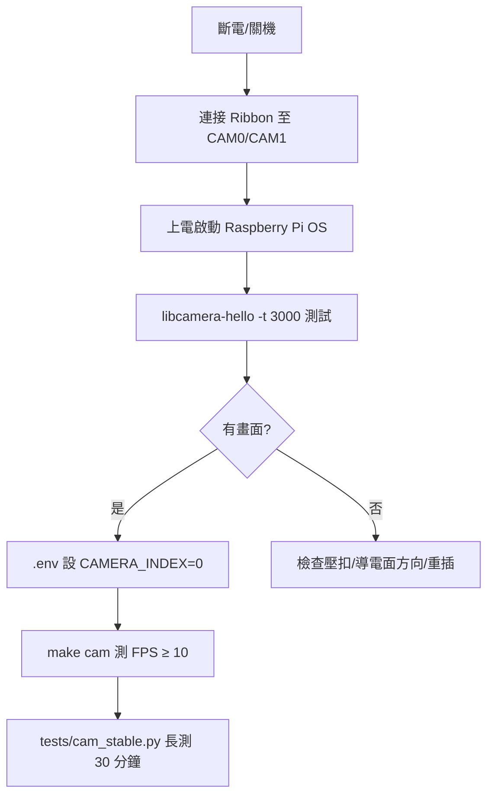

# 專案說明


## CI 驗收門檻與調整指南

本專案在 GitHub Actions 與樹莓派自架 Runner（self-hosted）都會產生測試 **Logs** 與 **Summary**。  
`tests/ci_summary.py` 會依照以下門檻自動判分（未達標 → 工作流失敗）。

### 驗收指標與預設門檻

| 指標來源 (log)       | 指標                          | 預設門檻 | 通過條件 |
|----------------------|-------------------------------|----------|----------|
| `logs/cam.log`       | 平均 FPS                      | `>= 10`  | 平均 FPS ≥ 10 |
| `logs/cam_stable.log`| 平均 FPS（30 分鐘穩定度）     | `>= 10`  | 平均 FPS ≥ 10 |
| `logs/id_test.log`   | 人臉辨識準確率 ACC            | `>= 0.80`| ACC ≥ 0.80 |
| `logs/api_test.log`  | /detect_face 延遲 p95（秒）   | `<= 1.0` | p95 ≤ 1.0 s |
| `logs/e2e.log`       | E2E 心跳/推播次數             | `>= 1`   | 次數 ≥ 1 |

> 以上門檻可用環境變數覆寫（見下節）。

### 如何在 GitHub Actions 調整門檻

在各工作流的 `env:` 加上或修改以下環境變數：

```yaml
env:
  THRESH_MIN_FPS: "12"              # cam / cam_stable 的平均 FPS 下限
  THRESH_MIN_ACC: "0.85"            # ACC 下限
  THRESH_MAX_API_P95: "0.8"         # API p95 上限（秒）
  THRESH_E2E_MIN_HEARTBEATS: "2"    # E2E 心跳/推播次數下限
```

> 這些變數已預先加入四個 workflow：`task1.yml`、`task3.yml`、`task4_e2e.yml`、`pi-stability.yml`。  
> 每次執行後，請到 **Actions → 該次工作流 → Summary** 觀看彙總表格與通過/失敗原因；`logs/` 也會作為 artifact 上傳可下載。

### 在樹莓派自架 Runner 調整門檻（pi-stability-30min）

在 **`.github/workflows/pi-stability.yml`** 的 `env:` 區塊調整門檻；或在 Runner 環境輸出為 shell 環境變數：

```bash
export THRESH_MIN_FPS=12
export THRESH_MIN_ACC=0.85
export THRESH_MAX_API_P95=0.8
export THRESH_E2E_MIN_HEARTBEATS=2
```

> 標準 30 分鐘長測腳本：`tests/cam_stable.py`  
> 額外會每 60 秒記錄 `TEMP/CPU%/MEM%/THR/FPS`，有助於觀察溫度節流與效能。

### 在本機/VS Code 調整門檻（手動驗收）

本機直接執行測試後，也能用相同門檻來判斷：

```bash
export THRESH_MIN_FPS=12
export THRESH_MIN_ACC=0.85
export THRESH_MAX_API_P95=0.8
export THRESH_E2E_MIN_HEARTBEATS=2
python tests/ci_summary.py   # 會讀取 logs/* 並在終端輸出 PASS/FAIL
```

### 常見問題

- **為何 CI 時偶爾 ACC 沒達標？**  
  請確認 `tests/known/` 與 `tests/test/` 是否有足夠且乾淨的測試資料；影像解析度/光線差異也會影響 ACC。

- **為何 CI 沒有跑到某些指標？**  
  若該 log 不存在（例如未跑 `make id`），Summary 會跳過該指標，也不會列入判分。請確認工作流是否執行對應測試。

- **如何改變長測時長與監控頻率？**  
  設定 `DURATION_SEC`（預設 1800 秒）與 `MONITOR_INTERVAL_SEC`（預設 60 秒），例如：  
  `DURATION_SEC=3600 MONITOR_INTERVAL_SEC=30 python tests/cam_stable.py`。

---

## 快速開始（Quick Start）
## 快速開始（Quick Start）

> 目標：5–10 分鐘在本機/樹莓派 5 跑通「相機、辨識、API、顯示」的最小驗收。

### 1) 取得原始碼與環境
```bash
git clone <your-repo-url>
cd <your-repo>
python -m venv .venv && source .venv/bin/activate   # Windows: .venv\Scripts\activate
pip install -r requirements.txt
cp .env.example .env
```

### 2) 設定 .env（相機 / 日誌 / DB）
- **樹莓派 5 + 實體鏡頭**：`CAMERA_INDEX=0`
- **筆電/USB Webcam**：通常 `CAMERA_INDEX=0`
- **無相機/CI**：`CAMERA_INDEX=-1`（無頭模式會自動產生影格）

> 其他常用變數：`LOG_DIR=logs`、`RECOG_TOLERANCE=0.6`、`AD_IMAGE_DIR=advertisements/images`。

### 3) 最小測試
```bash
make cam             # 量測 FPS → logs/cam.log（目標：平均 ≥ 10）
make id              # 辨識 ACC → logs/id_test.log（目標：ACC ≥ 0.80）
python tests/api.py &
sleep 2 && curl -s -F image=@tests/test/sample.jpg http://127.0.0.1:8000/detect_face
python tests/display_sqlite.py   # 讀 5 筆 → logs/text_test.log（目標：<5s）
make e2e            # 端到端心跳 30 秒 → logs/e2e.log（至少 1 次）
```

### 4) GitHub Actions（可選）
- 推上 GitHub 後，至 **Actions** 觸發：`task1`（cam/id）、`task3`（API/SQLite/display）、`task4-e2e`（E2E）、`pi-stability-30min`（樹莓派 Runner）。
- Summary 會顯示 FPS/ACC/延遲等指標，並依門檻自動判分（詳見下文「CI 驗收門檻與調整指南」）。

## 硬體接線與相機設定（Raspberry Pi 5 / USB Webcam）
## 硬體接線與相機設定（Raspberry Pi 5 / USB Webcam）

### A) 樹莓派 5 + Ribbon CSI 相機
1. **斷電**後操作，避免熱插拔損傷。
2. 找到 **CAM0 / CAM1** 連接器（白色/黑色壓扣）。
3. **打開壓扣** → 將 **排線導電面（銀色/金屬面）** 對準連接器金屬端插入 → **壓回固定**。  
   - **原則**：*導電面對導電面*。不同相機模組或排線批次的「藍色拉片」方向可能不同，請以**導電面**對齊為準。
4. 裝妥後上電，驗證：
   ```bash
   libcamera-hello -t 3000    # 3 秒測試預覽，能看到畫面表示連接成功
   ```
5. OpenCV 取流：多數情況 `cv2.VideoCapture(0)` 可讀到相機；若讀不到，可考慮：
   - 以 **GStreamer** 管線接入 OpenCV。
   - 使用 **v4l2loopback** 將 libcamera 流映射到 `/dev/video*`。
6. 長測建議加裝散熱（風扇/散熱片），並以 `tests/cam_stable.py` 監控 `TEMP/CPU%/MEM%/THR/FPS`。

#### Ribbon 連接示意（ASCII）
```
[Camera Module]
   ||  ←（導電面）
  ==================  Ribbon Cable
        ||
        ||  （導電面朝連接器金屬端）
+-----------------------------+
| Raspberry Pi 5              |
| [ CAM0 ] [ CAM1 ]  ...      |
|     ||        ||            |
|   壓扣↑      壓扣↑          |
+-----------------------------+
```

#### Mermaid 流程（安裝與測試）


### B) 筆電 / 市售 USB Webcam
1. 插入 USB 相機，系統通常會建立 `/dev/video0`（Linux）或 DirectShow 設備（Windows）。
2. `.env` 設 `CAMERA_INDEX=0`，解析度可用 `FRAME_WIDTH/FRAME_HEIGHT` 調整。
3. 驗證：`python -c "import cv2;cap=cv2.VideoCapture(0);print(cap.isOpened())"` 應輸出 `True`。
4. 進行相同測試流程：`make cam`、`make id`、`tests/cam_stable.py`。

### 常見故障排除
- **畫面全黑 / cap.isOpened()=False**：
  - 檢查排線導電面方向與壓扣是否確實鎖緊。
  - 更新系統與韌體：`sudo apt update && sudo apt full-upgrade`。
  - 改用 GStreamer 管線或 v4l2loopback。
- **長測時 FPS 下降**：
  - 檢查溫度（`TEMP`）與 `get_throttled`；必要時降解析度或加強散熱。
  - 供電不足也會觸發降頻，建議 5V/5A 電源供應器。


### 依賴鎖定（requirements.lock）
工作流會在找不到 `requirements.lock` 時，自動以 **pip-compile** 從 `requirements.txt` 產生鎖檔，並優先以鎖檔安裝（可用 `USE_PIP_COMPILE=false` 關閉）。
- 若你要固定版本，建議把跑出的 `requirements.lock` 一併 commit。
- Workflow 也會把 `requirements.lock` 上傳為 artifact 供下載檢視。
